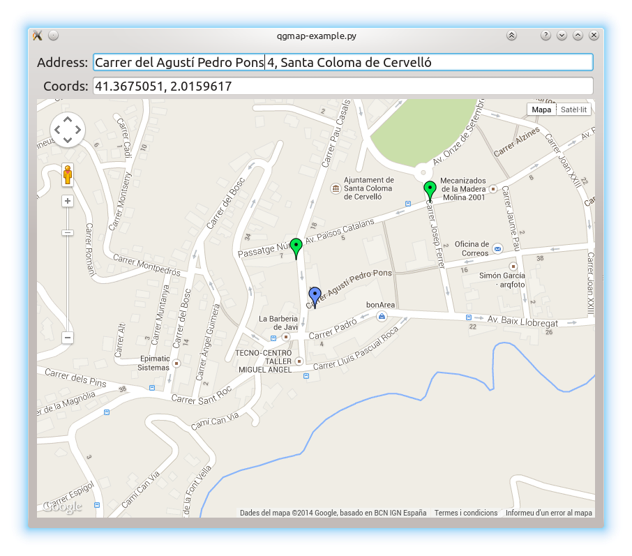

python-qgmap
============

Qt Google Map widget for PySide/PyQt6

## Features:

- Specify locations either by latitude, longitude pairs or street addresses by means of GeoCoding
- Programatically centering, zooming and manipulate markers
- Flexible marker properties (ie. draggable, icon, title...)
- Emits signals on user actions: dragged markers, pans or zooms
- Easy to extend, thanks to the painless python-qt-javascript interface

## Installation

By using pip:

	$ pip3 install qgmap

## Usage

Two main classes are provided:

- qgmap.GeoCoder:
	Retrieves geo-coordinates (latitude, longitude) from street addresses
- qgmap.QGoogleMap:
	A WebView widget containing a GoogleMap, with some convenience accessors
	to manage center, zoom, markers...

See the main example code at qgmap-example.py

## Using it with PyQt6

By default the classes use PySide, but the code works for PyQt6 if you
set to False the usePySide module variable by hand.

Any suggestion to make this less hacky is welcome.

## Acknoledgements

This Python code has been inspired in Henrik Hartz's C++ example code:

	https://blog.qt.digia.com/blog/2008/07/03/putting-qtwebkit-to-use-with-google-maps/

